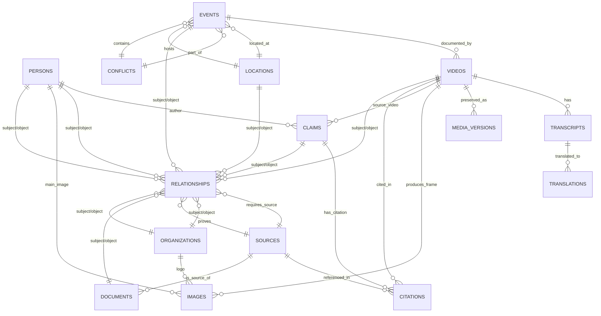

# ERD — ARCHIVO DOCUMENTAL (v01)



## Núcleo conceptual

> **RELATIONSHIPS es la tabla maestra.** Cualquier entidad (PER, ORG, GOV, VID, IMG, AUD, CLM,
> SRC, DOC, LOC, REL, CNF, ART) puede aparecer como *sujeto* o como *objeto* de una relación,
> mediante el patrón polimórfico `(subject_id, subject_type) → predicate → (object_id, object_type)`.
> Toda relación DEBE llevar `source_id`. Sin fuente, no existe relación.

## Regla de oro

`No almacenar conclusiones: almacenar evidencia, relaciones, fuentes y grados de certeza.`

## Caminos de navegación (Prompt §40)

```
VIDEO → PERSONA → ORGANIZACIÓN → GOBIERNO → EMPRESA → CONTRATO → DOCUMENTO
      → EVENTO → AFIRMACIÓN → FUENTE → OTROS VIDEOS
FECHA → EVENTOS → VIDEOS → DECLARACIONES → PERSONAS → DOCUMENTOS
      → VERSIONES CONTRADICTORIAS
```